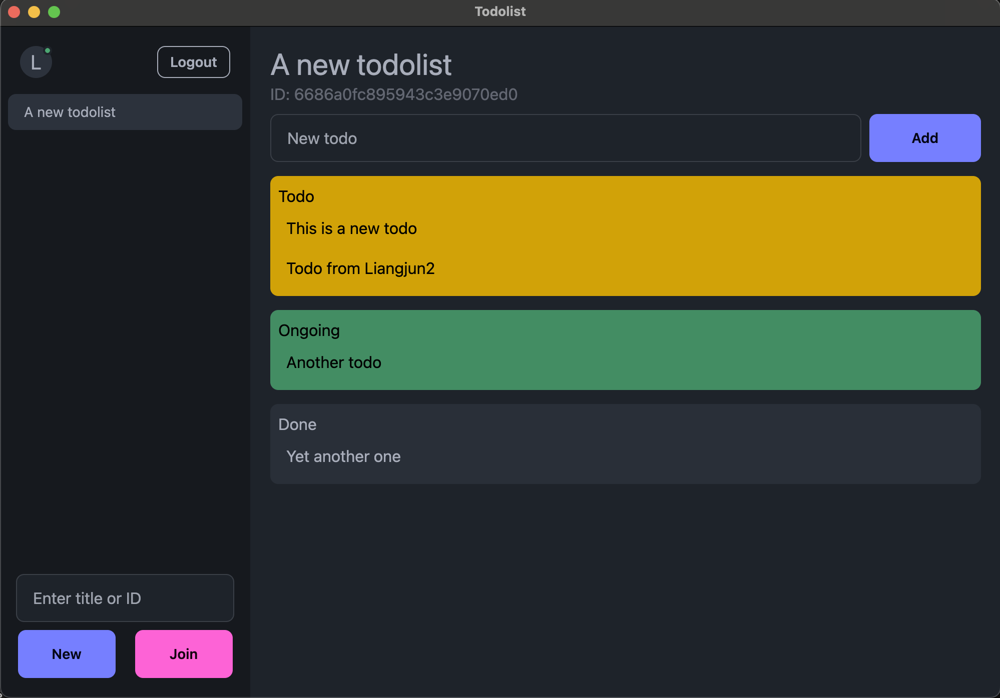

# Todo List Application

A todo list application built with Electron, Svelte, and Express.

## Demo

[](https://youtu.be/o5C61b_XN3Y)

Click the image above to watch a demonstration of the application.

## Prerequisites

Before you begin, ensure you have met the following requirements:

- Node.js
- npm
- Docker and Docker Compose

## Installation and Running the Application

### Production Build

1. Clone the repository:

   ```
   git clone [your-repo-url]
   cd [your-repo-name]
   ```

2. Install dependencies:

   ```
   npm install
   ```

3. Start the Docker containers:

   ```
   docker-compose -f docker-compose.prod.yml up --build
   ```

4. Build and run the client:
   ```
   cd client
   npm run build-and-run
   ```

### Development Build

1. Follow steps 1-2 from the Production Build.

2. Start the Docker containers for development:

   ```
   docker-compose -f docker-compose.dev.yml up --build
   ```

3. In the `server` folder, start the server in watch mode:

   ```
   cd server
   npm run watch
   ```

4. In the `client` folder, start the client in watch mode:
   ```
   cd client
   npm run watch-webpack
   npm run watch-electron
   ```

## Testing

To run the tests:

```
cd server
npm run test
```
